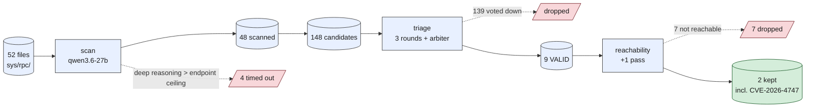

# Run 3 — qwen3.6-27b on `sys/rpc/`

`qwen/qwen3.6-27b` · AISLE nano-analyzer pipeline · full FreeBSD `sys/rpc/` (~50 files) ·
OpenAI-compatible endpoint.

**Headline:** the only local model in this repo that took the real CVE cleanly from scan all the
way to a kept, attacker-reachable finding — but its deep reasoning made the *infrastructure* the
bottleneck, not the model.

## Numbers

| Stage | Result |
|---|---|
| Files scanned | 48 / 52 (4 timed out: `clnt_vc.c`, `rpc_callmsg.c`, `rpcsec_gss_prot.c`, `svc_vc.c`) |
| Candidates (scan) | 148 |
| VALID (post-triage) | 9 |
| Reachable (kept) | 2 — incl. **CVE-2026-4747** |
| CVE end-to-end | scan = **CRITICAL** → triage = **VALID** → reachability = **KEPT** |

## vs the other models

| Model | VALID | Reachable | CVE-2026-4747 |
|---|---|---|---|
| `gemma-4-31b-it` | 30 | 5 | missed at scan (invented a bound) |
| `gpt-oss-20b` | 21 | 4 | found, voted out at triage |
| `qwen3.6-27b` | 9 | 2 | **caught: scan → triage → reachability** |

*(Not perfectly apples-to-apples: qwen3.6 scanned 48 of 52 files vs the full 52 for the others. The
CVE file did scan, so its catch is real.)*

## Quick thoughts

- **Best read of the three.** Correct root cause at scan: attacker-controlled `oa_length`, no bound
  before the `memcpy` into the 128-byte `rpchdr`. No invented bounds check, no UNCERTAIN waffle. It
  just read the code right.
- **Strictest grader.** 148 → 9 → 2, by far the lowest false-positive load. The deep reasoning seems
  to cut noise as well as it catches signal.
- **Fragile under load and duration.** Minutes per call, thousands of reasoning tokens. At high
  concurrency the biggest files get rate-limited away; even serial, the very largest can exceed the
  endpoint's per-request ceiling. 4 / 52 never scanned, and the CVE file timed out on its first two
  passes.
- **Needed harness tuning, not model tuning.** A longer client timeout and a serial re-run got the
  CVE file through. The model was ready; the scaffolding had to catch up. "System over model," from
  the other side.

## Reproduction notes

- Same pipeline and scripts as the other runs: `scan-and-filter.sh` over the directory (scan +
  triage), then the reachability stage on the graduated findings.
- qwen3.6-27b is a reasoning model. For a full sub-system run it needs a generous client read timeout
  and, for the heaviest files, low/serial concurrency so individual requests don't exceed the
  endpoint's ceiling.
